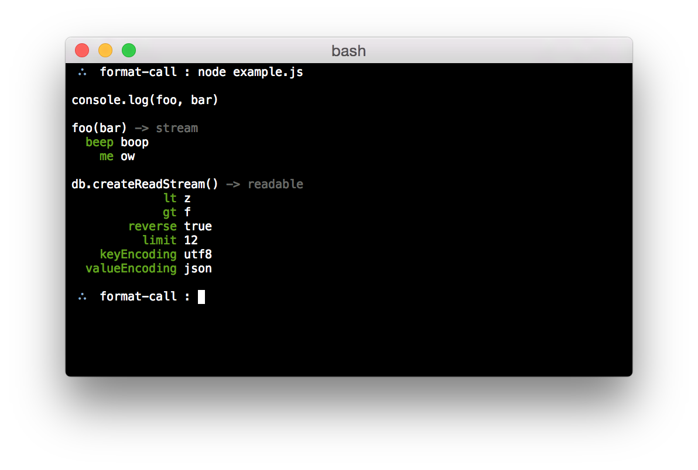

# format-call

  Format a function call nicely

  

## Example

```js
var format = require('format-call');


console.log(format('console.log', ['foo', 'bar']));

console.log(format('foo', ['bar', { beep: 'boop', me: 'ow' }], 'stream'));

console.log(format('db.createReadStream', [{
  lt: 'z',
  gt: 'f',
  reverse: true,
  limit: 12,
  keyEncoding: 'utf8',
  valueEncoding: 'json'
}], 'readable'));
```

## Installation

```bash
$ npm install format-call
```

## API

### format(name, args[, type])

  Return a string to be written to a terminal for a function call consisting of

  - `name` the function name
  - `args` array of arguments
  - `type` optional return type

  Conventions are applied to format `args` nicely:

  - callbacks are removed
  - option / value objects are displayed _nicely_

## License

  MIT

